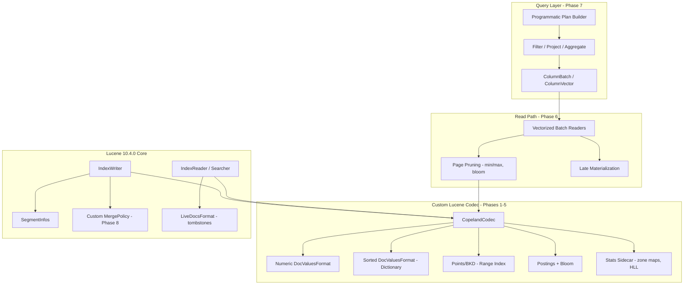

# CopelandDB — Columnar Storage Study Roadmap

A phased roadmap for [CopelandDB](../), a study-oriented mini analytics database built on top of Lucene 10.4.0. The goal is *not* to ship a production database — it is to build, with our own hands, every layer of a modern columnar store so we can reason about its tradeoffs.

## Goals

- Understand a modern columnar storage format end-to-end (page layout, encodings, compression, statistics, pruning).
- Understand Lucene's segment + codec architecture by participating in it (custom `Codec`, `DocValuesFormat`, `PostingsFormat`, `PointsFormat`, `MergePolicy`).
- Understand the read path of a vectorized analytical engine (batches, late materialization, predicate pushdown, SIMD).
- Build a tiny query layer (filter / project / aggregate) so we can run real workloads and benchmark.
- Every phase produces a deliverable + a short tradeoff write-up under [notes/](notes/).

## Non-goals

- SQL parser / planner (a programmatic builder is enough; Calcite is optional in Phase 7).
- Distribution, replication, durability beyond `fsync` semantics Lucene already gives us.
- Production-grade error handling, security, multi-tenancy.
- Beating Parquet / DuckDB on benchmarks — we compare, but we don't tune to win.

## Stack & build setup

- Java 26 (toolchain). Today's [../build.gradle.kts](../build.gradle.kts) only applies the `java` plugin without a toolchain block — needs `java { toolchain { languageVersion = JavaLanguageVersion.of(26) } }`.
- Gradle 9.4.0 (already wired in [../gradle/wrapper/gradle-wrapper.properties](../gradle/wrapper/gradle-wrapper.properties)).
- Lucene 10.4.0 modules to pull in:
  - `org.apache.lucene:lucene-core`
  - `org.apache.lucene:lucene-codecs`
  - `org.apache.lucene:lucene-backward-codecs`
  - `org.apache.lucene:lucene-analysis-common`
  - `org.apache.lucene:lucene-queries`
- JMH for microbenchmarks (added in Phase 9).
- JDK incubator/preview flags for the Vector API and (optionally) Pattern Matching (Phase 6/10).
- Existing [../src/main/java/dev/oddsystems/copeland/Main.java](../src/main/java/dev/oddsystems/copeland/Main.java) uses JEP 512 instance-main + `IO.println`, so we keep `--enable-preview` if we stay on instance-main; otherwise rewrite to a classic `main(String[])`.

## Architecture

## Phased roadmap

Each phase follows the same shape: **Learning objective → What to build → Lucene SPIs to study → Tradeoffs to explore → Deliverable**.

### Phase 0 — Wire-up and reconnaissance

- **Learn**: Lucene segment file layout, default codec, how `IndexWriter` produces files.
- **Build**: Java 26 toolchain in [../build.gradle.kts](../build.gradle.kts); Lucene deps; a `SegmentDumper` tool that writes ~10k docs with the default codec and prints the resulting files + their sizes; rewrite [../src/main/java/dev/oddsystems/copeland/Main.java](../src/main/java/dev/oddsystems/copeland/Main.java) into a small CLI.
- **Lucene SPIs**: `Codec.getDefault()`, `SegmentInfos`, `SegmentReader`, `Directory`, `IndexInput` / `IndexOutput`.
- **Tradeoffs**: none yet — orientation phase.
- **Deliverable**: `copeland dump <indexDir>` prints per-segment file inventory + sizes; [notes/00-segment-anatomy.md](notes/00-segment-anatomy.md).

### Phase 1 — `CopelandCodec` skeleton (FilterCodec pass-through)

- **Learn**: Codec SPI, `ServiceLoader` registration (`META-INF/services/org.apache.lucene.codecs.Codec`), per-field codec selection (`PerFieldDocValuesFormat`, `PerFieldPostingsFormat`).
- **Build**: `dev.oddsystems.copeland.codec.CopelandCodec` extending `FilterCodec` and delegating every format to Lucene's default 10.4 codec. Wire it into `IndexWriterConfig.setCodec(...)`. Verify a full write/read roundtrip.
- **Lucene SPIs**: `Codec`, `FilterCodec`, `PerFieldDocValuesFormat`, `PerFieldPostingsFormat`, `NamedSPILoader`.
- **Tradeoffs**: per-field codec routing vs uniform codec; cost of indirection.
- **Deliverable**: green roundtrip test under `src/test/java/.../codec/CopelandCodecRoundtripTest.java`.

### Phase 2 — Numeric `DocValuesFormat` (the heart of the format)

- **Learn**: how Lucene stores `NumericDocValues` and `SortedNumericDocValues`; page-oriented column chunks à la Parquet / ORC.
- **Build**: `CopelandNumericDocValuesFormat` that writes columns in fixed-size pages (default 1024 rows). Per-page header carries row count, min, max, null bitmap pointer, encoding tag, optional compression tag. Encodings to implement: PLAIN, BIT_PACKED (Lucene `PackedInts`), FOR (frame of reference), DELTA, RLE. Optional outer compression: LZ4 via `org.apache.lucene.util.compress.LZ4`.
- **Lucene SPIs**: `DocValuesFormat`, `DocValuesConsumer`, `DocValuesProducer`, `PackedInts`, `LZ4`, `DataInput` / `DataOutput`.
- **Tradeoffs**: page size vs random access cost vs compression ratio; encoding-selection heuristics (sample first N values? min/max-driven?); FOR vs DELTA on sorted timeseries vs random; LZ4 on already bit-packed data (often hurts).
- **Deliverable**: encoder / decoder + microbench harness in [notes/02-numeric-encodings.md](notes/02-numeric-encodings.md) comparing sizes and decode speed on synthetic + real data (NYC taxi `fare_amount`, `tpep_pickup_datetime`).

### Phase 3 — Sorted / string `DocValuesFormat` with dictionary encoding

- **Learn**: dictionary encoding, ordinal pages, global vs per-page dictionaries, FST.
- **Build**: `CopelandSortedDocValuesFormat` with a per-segment sorted dictionary (sorted `byte[]` + binary search baseline, then FST for `termToOrd`), and per-page ordinal pages with bit-packed ordinals. Add `SortedSetDocValues` support.
- **Lucene SPIs**: `SortedDocValues`, `SortedSetDocValues`, `org.apache.lucene.util.fst.FST`, `BytesRefHash`, `ByteBlockPool`.
- **Tradeoffs**: high vs low cardinality (when dictionary stops paying); global vs delta-per-page dictionaries; FST lookup cost vs sorted-bytes binary search; ordinal-only filters (cheap) vs value materialization (expensive).
- **Deliverable**: dictionary benchmark on `payment_type` (low card) and `pickup_location` (medium card) and a synthetic UUID column (high card); [notes/03-dictionary.md](notes/03-dictionary.md).

### Phase 4 — Statistics, zone maps, bloom filters

- **Learn**: column / segment / page-level statistics; cardinality estimation; bloom filters.
- **Build**: per-segment column metadata file (`*.cpd_meta`) with min, max, null count, HLL sketch for distinct count. Per-page min/max is already produced in Phase 2 — extend with bloom filters for equality lookups, adapting `BloomFilteringPostingsFormat` patterns to DocValues.
- **Lucene SPIs**: `BloomFilteringPostingsFormat` (in `lucene-codecs`), `FuzzySet`, `BytesRefHash`.
- **Tradeoffs**: stats granularity (segment vs page) vs metadata overhead; HLL precision vs size; bloom false-positive rate vs memory.
- **Deliverable**: `Predicate.canSkip(pageStats)` API consumed in Phase 6; [notes/04-pruning.md](notes/04-pruning.md).

### Phase 5 — Range index via `PointsFormat` / BKD

- **Learn**: BKD tree layout, multi-dim points, leaf block compression.
- **Build**:
  - Phase 5a — use Lucene's default `PointsFormat` for timestamp + numeric range columns; measure.
  - Phase 5b — implement a minimal custom `PointsFormat` for 1-D timestamps to study leaf compression and prefix encoding.
- **Lucene SPIs**: `PointsFormat`, `PointsWriter`, `PointsReader`, `BKDWriter`, `BKDReader`.
- **Tradeoffs**: BKD vs sorted-column scan with min/max pruning (when is the index worth it?); leaf size tradeoff; 1-D vs k-D.
- **Deliverable**: range-query benchmark on a 100M-row timestamp column; [notes/05-bkd.md](notes/05-bkd.md).

### Phase 6 — Vectorized read path

- **Learn**: vectorized execution, batch sizing, late materialization, branch-free decoding.
- **Build**:
  - `ColumnVector` (primitive-typed, heap arrays first; off-heap via FFM as stretch).
  - `ColumnBatch` of N rows (default 1024).
  - `VectorizedColumnReader` per column type that decodes one page into a `ColumnVector`.
  - `BulkPredicate` evaluating predicates over a `ColumnVector`, returning a selection vector.
  - Late materialization: predicates first, only materialize surviving doc ids for projected columns.
  - Integrate with Lucene's `DocIdSetIterator` so existing queries still compose.
- **Lucene SPIs**: `DocIdSetIterator`, `BulkScorer`, `Scorer`, `LeafReaderContext`.
- **Tradeoffs**: heap vs off-heap vectors; batch size vs L1 / L2 footprint; early vs late materialization on selective vs non-selective predicates; row-at-a-time vs batch-at-a-time decode.
- **Deliverable**: scan + filter benchmark with JMH; [notes/06-vectorization.md](notes/06-vectorization.md).

### Phase 7 — Query layer (filter / project / aggregate)

- **Learn**: pull vs push execution models; operator composition; group-by strategies (hash, ordinal-based for low-cardinality).
- **Build**: programmatic plan builder `Query.from(index).where(...).select(...).groupBy(...).agg(...)`. Operators: `Filter`, `Project`, `Aggregate` (`count`, `sum`, `avg`, `min`, `max`), `TopN`. Group-by: ordinal-based hash table for dictionary-encoded columns; generic hash table otherwise.
- **Lucene SPIs**: `IndexSearcher`, `Collector`, `CollectorManager` (for parallelism across segments).
- **Tradeoffs**: pull vs push; Volcano vs vectorized; ordinal-aware aggregation vs generic; parallelism unit = segment.
- **Deliverable**: TPC-H Q1 / Q6 lite or NYC-taxi "avg fare by payment_type and pickup hour"; [notes/07-operators.md](notes/07-operators.md).

### Phase 8 — Segment lifecycle, merges, deletes

- **Learn**: how Lucene gives us MVCC and durability for free; merge policies and amplification tradeoffs.
- **Build**: a `CopelandMergePolicy` (start by extending `TieredMergePolicy`, then study and re-implement key bits); wire deletes through `IndexWriter.deleteDocuments(...)` and observe `LiveDocsFormat`; soft-deletes for time-partitioned data.
- **Lucene SPIs**: `MergePolicy`, `TieredMergePolicy`, `LogMergePolicy`, `LiveDocsFormat`, `IndexDeletionPolicy`, `SnapshotDeletionPolicy`.
- **Tradeoffs**: write vs read vs space amplification; tiered vs leveled; soft vs hard deletes; merge throttling.
- **Deliverable**: long-running ingest + query script that prints amplification metrics; [notes/08-merging.md](notes/08-merging.md).

### Phase 9 — Benchmark suite & comparisons

- **Learn**: how to measure honestly.
- **Build**: JMH module; macro-bench harness with NYC taxi + a synthetic 100M-row generator. Compare CopelandDB vs (a) Lucene default codec on the same data and (b) Parquet via `parquet-mr` (read-only comparison).
- **Tradeoffs**: on-disk size, build time, scan throughput, filtered scan, group-by latency.
- **Deliverable**: [notes/09-benchmarks.md](notes/09-benchmarks.md) with charts.

### Phase 10 — Stretch: SIMD, async I/O, off-heap

- **Learn**: JDK Vector API; FFM API for off-heap buffers; async / scatter-gather page prefetch.
- **Build**: Vector API decoders for BIT_PACKED + FOR; predicate evaluators over `ColumnVector` using vector lanes; off-heap `ColumnVector` backed by `MemorySegment`; async page prefetch on `Directory` / `IndexInput`.
- **Tradeoffs**: lane width selection; GC pressure vs FFM cost; prefetch depth vs memory.
- **Deliverable**: incremental wins folded into Phase 9 benchmarks; [notes/10-simd-ffm.md](notes/10-simd-ffm.md).

## Suggested reading list

Maintained alongside the plan in [reading.md](reading.md) starting in Phase 0.

- Lucene 10.x source: `org.apache.lucene.codecs.*`, especially the current default `Lucene10*Codec` family, `PerFieldDocValuesFormat`, `Lucene90DocValuesFormat`, `BloomFilteringPostingsFormat`.
- Parquet spec (Apache Parquet Thrift IDL, encoding doc).
- ORC spec.
- "Integrating Compression and Execution in Column-Oriented Database Systems" — Abadi, Madden, Ferreira (2006).
- "C-Store: A Column-oriented DBMS" — Stonebraker et al. (2005).
- "Vectorization vs. Compilation in Query Execution" — Sompolski, Zukowski, Boncz (2011).
- "Decoding billions of integers per second through vectorization" — Lemire, Boytsov (2015).
- Druid and ClickHouse blog posts on segment / part layout.
