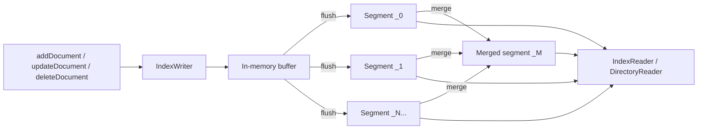
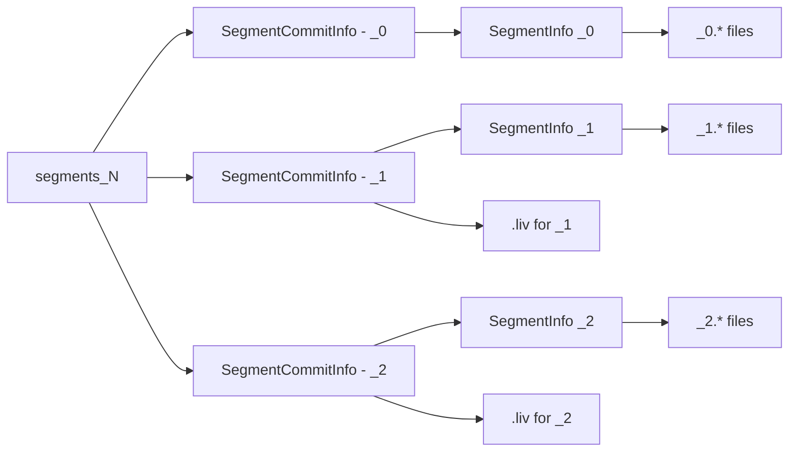
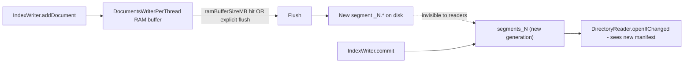
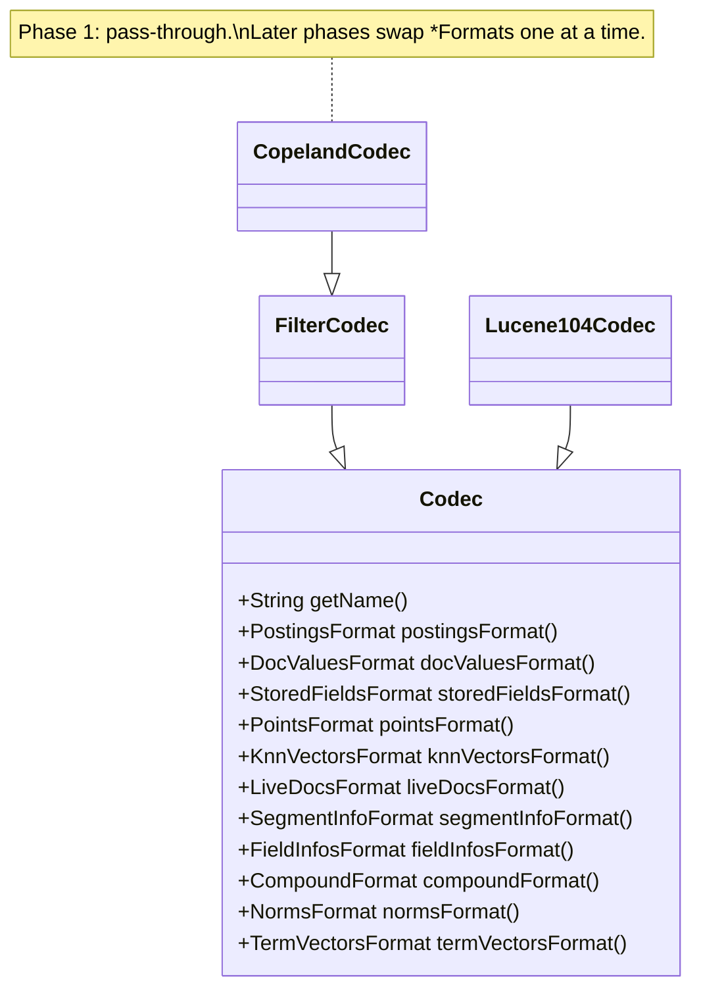

# Phase 0 — Learning Material

> Wire-up and reconnaissance. Before we implement anything, we make Lucene's
> existing machinery visible so we have something concrete to participate in.

This document covers everything Phase 0 of [the plan](../PLAN.md#phase-0--wire-up-and-reconnaissance) asks you to learn:
Lucene's segment file layout, the default codec, how `IndexWriter` produces files, and the SPIs
`Codec.getDefault()`, `SegmentInfos`, `SegmentReader`, `Directory`, `IndexInput`, and `IndexOutput`.

Companion files:
- [00-segment-anatomy.md](00-segment-anatomy.md) — running notes you fill in while doing the exercises.
- Code under [../../src/main/java/dev/oddsystems/copeland/tools/](../../src/main/java/dev/oddsystems/copeland/tools/) — the `SampleIndexer` and `SegmentDumper` tools we'll use throughout.

---

## 1. Why we start here

CopelandDB will be a custom `Codec` plugged into Lucene's segment machinery. That means we inherit, for free:

- Segment lifecycle (write -> flush -> commit -> merge).
- Snapshot-isolated reads.
- Deletes via a tombstone bitmap.
- A robust file abstraction (`Directory`).
- A binary I/O layer (`IndexInput` / `IndexOutput`).
- SPI-based discovery of formats.

Before we replace any part of that machinery, we have to be able to *see* it. Phase 0 builds two tiny tools:

- `copeland write-sample <dir> [numDocs] [--cfs]` — uses the default codec to produce an index.
- `copeland dump <dir>` — reads the segment manifest and prints every file with its size.

Everything below explains what those tools are doing.

---

## 2. The 10,000-foot view

Lucene is a write-once-then-mostly-read **segmented** store.



Three structural ideas:

- **Document** — a bag of `(fieldName, fieldValue)` pairs. There is no row schema enforced at the index level; fields appear or don't.
- **Segment** — an immutable, self-contained snapshot of N documents on disk. A segment has its own dictionaries, postings, doc values, points, deletes bitmap, etc.
- **Index** — the ordered list of *live* segments as recorded in the latest `segments_N` file.

Key consequence: writes are append-only. Deletes are tombstones (a bitmap stored alongside the segment). Updates are delete + add. The merge process eventually rewrites segments to physically remove tombstoned docs.

---

## 3. The segment, in detail

A segment is a family of files sharing a name prefix like `_0`, `_1`, `_2`. Each file extension tells you what kind of data is inside.

Two layouts:

1. **Per-file** — each sub-format writes its own file(s) with descriptive extensions (`.fdt`, `.tim`, `.doc`, `.dvd`, ...).
2. **Compound file** — all per-segment files packed into `.cfs` (data blob) + `.cfe` (entry table). Saves file-handle / inode pressure for small segments; the default for young, small segments. Use `IndexWriterConfig.setUseCompoundFile(false)` to keep everything visible.

### Common file extensions in Lucene 10.x

| Ext   | Producer (`*Format`)                  | What's inside                                                  |
|-------|---------------------------------------|----------------------------------------------------------------|
| `.si`     | `SegmentInfoFormat`               | Per-segment manifest: name, codec, maxDoc, version, id        |
| `.cfs`    | `CompoundFormat`                  | Compound blob (all sub-format files packed in)                 |
| `.cfe`    | `CompoundFormat`                  | Compound entry table (filename -> offset/length)               |
| `.fnm`    | `FieldInfosFormat`                | Field schema: name, number, indexed flags, dv type             |
| `.fdt`    | `StoredFieldsFormat`              | Stored-field data (the row store)                              |
| `.fdx`    | `StoredFieldsFormat`              | Stored-field block index                                       |
| `.fdm`    | `StoredFieldsFormat`              | Stored-field metadata                                          |
| `.tim`    | `PostingsFormat`                  | Term dictionary (terms + on-disk pointers)                     |
| `.tip`    | `PostingsFormat`                  | Term-dictionary index (FST or block-tree)                      |
| `.tmd`    | `PostingsFormat`                  | Term-dictionary metadata (per-field stats)                     |
| `.psm`    | `Lucene104PostingsFormat`         | Postings format-level metadata (10.4-only)                     |
| `.doc`    | `PostingsFormat`                  | Per-term doc lists + frequencies + skip data                   |
| `.pos`    | `PostingsFormat`                  | Per-term positions                                             |
| `.pay`    | `PostingsFormat`                  | Per-term payloads + offsets                                    |
| `.dvd`    | `DocValuesFormat`                 | Doc values data (columnar)                                     |
| `.dvm`    | `DocValuesFormat`                 | Doc values metadata (field -> data ranges)                     |
| `.nvd`    | `NormsFormat`                     | Per-doc field-length norms                                     |
| `.nvm`    | `NormsFormat`                     | Norms metadata                                                 |
| `.kdd`    | `PointsFormat`                    | BKD-tree leaf data                                             |
| `.kdi`    | `PointsFormat`                    | BKD-tree inner-node index                                      |
| `.kdm`    | `PointsFormat`                    | BKD metadata                                                   |
| `.vec` / `.vex` / `.vem` / others | `KnnVectorsFormat`    | Vectors + graph for kNN                                        |
| `.tvd` / `.tvx` / `.tvm`          | `TermVectorsFormat`   | Per-doc term vectors (rare in modern indexes)                  |
| `.liv`    | `LiveDocsFormat`                  | Delete bitmap (live = 1, deleted = 0)                          |
| `segments_N` | (top-level, not per-segment)   | The index manifest: list of live segments at generation N      |
| `write.lock` | -                              | File lock guarding the index against concurrent writers        |

Note: which sub-formats actually emit files depends on which fields you indexed. Index only `DocValues` fields and you won't see `.doc`/`.pos`. Index only text and you won't see `.dvd`/`.dvm`. Our [SampleIndexer](../../src/main/java/dev/oddsystems/copeland/tools/SampleIndexer.java) deliberately uses several field kinds so the dump covers the spectrum.

---

## 4. The Codec, in detail

A `Codec` is a bag of `*Format` sub-SPIs. Lucene 10.4.0's default is **`Lucene104Codec`** (in `org.apache.lucene.codecs.lucene104`). Notice that only a handful of sub-formats are "Lucene104"; most are inherited from earlier versions. That's the codec philosophy at work: change only what needs changing per release, and reuse the rest.

```
Lucene104Codec  (file `_<seg>_<formatName>_<gen>.<ext>` for per-field formats)
 |-- PostingsFormat       PerFieldPostingsFormat(Lucene104PostingsFormat)
 |                        .tim .tip .tmd .psm .doc .pos .pay
 |-- DocValuesFormat      PerFieldDocValuesFormat(Lucene90DocValuesFormat)
 |                        .dvd .dvm
 |-- StoredFieldsFormat   Lucene90StoredFieldsFormat  (BEST_SPEED by default)
 |                        .fdt .fdx .fdm
 |-- TermVectorsFormat    Lucene90TermVectorsFormat   .tvd .tvx .tvm
 |-- FieldInfosFormat     Lucene94FieldInfosFormat    .fnm
 |-- SegmentInfoFormat    Lucene99SegmentInfoFormat   .si
 |-- LiveDocsFormat       Lucene90LiveDocsFormat      .liv
 |-- PointsFormat         Lucene90PointsFormat        .kdd .kdi .kdm
 |-- KnnVectorsFormat     PerFieldKnnVectorsFormat(Lucene99HnswVectorsFormat)
 |                        .vec .vex .vem (+ variants)
 |-- NormsFormat          Lucene90NormsFormat         .nvd .nvm
 +-- CompoundFormat       Lucene90CompoundFormat      .cfs .cfe
```

When a sub-format is wrapped by `PerFieldPostingsFormat` / `PerFieldDocValuesFormat` / `PerFieldKnnVectorsFormat`, the per-segment filename gets the *format name* embedded in it, like `_0_Lucene104_0.doc` or `_0_Lucene90_0.dvd`. The first underscore-prefix is the segment, the middle token is the format name, and the trailing `_0` is a generation number for that format within the segment. This is how `Codec.forName` later picks the right reader for each file.

Two more wrappers we'll use heavily later:

- **`PerFieldDocValuesFormat`** / **`PerFieldPostingsFormat`** — wrap a default and let you swap formats *per field name*. This is the seam where Phase 1's `CopelandCodec` will plug in: route specific fields to a Copeland format and pass the rest through to the default.

SPI registration lives in `META-INF/services/`:

```
META-INF/services/org.apache.lucene.codecs.Codec
META-INF/services/org.apache.lucene.codecs.DocValuesFormat
META-INF/services/org.apache.lucene.codecs.PostingsFormat
META-INF/services/org.apache.lucene.codecs.KnnVectorsFormat
```

When you call `Codec.getDefault()`, Lucene returns a static field on the core class (currently `Lucene104Codec`). When a segment is opened, Lucene reads the codec **name** from the `.si` file and uses `Codec.forName(name)` — a `NamedSPILoader` lookup against the SPI registry. That's why `lucene-backward-codecs` matters: it carries the codec implementations for older segment versions so they can still be read after an upgrade.

---

## 5. Directory & I/O

`Directory` is Lucene's file-system abstraction. The same code can target a real FS, an in-memory buffer, or a remote object store (with appropriate impls). Useful implementations from `org.apache.lucene.store`:

- `FSDirectory.open(Path)` — auto-selects the best impl for the OS. On 64-bit JVMs it usually returns `MMapDirectory`.
- `MMapDirectory` — memory-mapped, uses JDK FFM (`MemorySegment`). Reads cost a single page fault; writes still go through normal I/O.
- `NIOFSDirectory` — `FileChannel.read(ByteBuffer, position)`. Fallback when mmap is unavailable.
- `ByteBuffersDirectory` — in-memory. Great for tests.
- `RAMDirectory` — removed in 10.x. Use `ByteBuffersDirectory`.

Above the directory, every codec reads and writes through:

- **`IndexOutput`** (writes) — `writeByte`, `writeBytes`, `writeInt`, `writeLong`, `writeVInt`, `writeVLong`, `writeZInt`, `writeZLong`, `writeString`. Final pointer is recorded as the on-disk length.
- **`IndexInput`** (reads) — `readByte`, `readBytes`, `readInt`, `readLong`, `readVInt`, `readVLong`, `readZInt`, `readZLong`, `readString`. Adds `seek(long)`, `getFilePointer()`, `length()`, and `slice(...)` for sub-ranges.

The variable-length integer encodings (`readVInt` / `readVLong` / `readZInt` / `readZLong`) are pervasive throughout Lucene because most integers stored on disk are small. They are the closest thing to a "household name" you'll encounter when reading codec source.

---

## 6. SegmentInfos: the index manifest

Three closely related types you must keep straight:

| Type                  | Lifetime    | Per-thing                | Notable fields                                  |
|-----------------------|-------------|--------------------------|-------------------------------------------------|
| `SegmentInfo`         | per-segment | one per segment as written | `name`, `getCodec()`, `maxDoc()`, `getId()`, `getVersion()`, `getMinVersion()`, `files()` |
| `SegmentCommitInfo`   | per-commit  | wraps a `SegmentInfo`    | `getDelCount()`, `getSoftDelCount()`, `getDelGen()`, `getFieldInfosGen()`, `getDocValuesGen()`, `files()`, `sizeInBytes()` |
| `SegmentInfos`        | per-index   | the live segment list   | `size()`, `iterator()`, `totalMaxDoc()`, `getGeneration()`, `getCommitLuceneVersion()`, `getMinSegmentLuceneVersion()`, `getUserData()`, `getId()` |

Persisted as `segments_N` where `N` is monotonically increasing — every successful commit creates a new generation.



`SegmentInfos.readLatestCommit(Directory)` parses the most recent `segments_N` for you. That's what our [SegmentDumper](../../src/main/java/dev/oddsystems/copeland/tools/SegmentDumper.java) uses.

---

## 7. The write pipeline



Two moments worth pinning down:

- **Flush** — the in-memory buffer is converted to a new segment on disk. Triggered by `ramBufferSizeMB` (default 16 MB) or an explicit `flush()`. Files exist but are **not** referenced by `segments_N` yet.
- **Commit** — `IndexWriter.commit()` writes a fresh `segments_N` referencing the flushed segments. Only after commit do readers see the new data. Each commit is a new *generation*; old generations linger until `IndexDeletionPolicy` releases them.

`IndexWriter.close()` calls `commit()` by default unless you opt out via `setCommitOnClose(false)`.

---

## 8. The merge pipeline

Merges combine smaller segments into bigger ones to:

- Physically remove tombstoned docs.
- Reduce per-segment header / dictionary overhead.
- Reduce file handle / inode pressure.
- Let dictionary, FST, and DV statistics amortize over more data.

`MergePolicy` decides *what* to merge and *when*. The default is `TieredMergePolicy`. Phase 8 of [the plan](../PLAN.md#phase-8--segment-lifecycle-merges-deletes) is dedicated to merging in depth.

Two related trade-offs you'll meet again:

- **Write amplification** — bytes written / bytes ingested. More aggressive merging = higher WA.
- **Read amplification** — files / segments touched per query. Less aggressive merging = higher RA.

You can't minimize both at the same time; merge policies are a tunable trade-off.

---

## 9. The SPIs in one picture



`FilterCodec` is the comfortable starting point: it takes a delegate `Codec` in its constructor and forwards every `*Format()` accessor to it. To customize, override just the methods you want to replace.

---

## 10. Exercises

These exercises produce the data you'll record in [00-segment-anatomy.md](00-segment-anatomy.md).

1. **Default run, no compound file.**
   ```bash
   ./gradlew run --args="write-sample build/tmp/phase0-nocfs 10000"
   ./gradlew run --args="dump build/tmp/phase0-nocfs"
   ```
   - Identify every file extension printed and match it against [the file extension table](#common-file-extensions-in-lucene-10x).
   - Record per-extension sizes. Which family dominates? Why does that make sense for this workload?

2. **Same data, compound file.**
   ```bash
   ./gradlew run --args="write-sample build/tmp/phase0-cfs 10000 --cfs"
   ./gradlew run --args="dump build/tmp/phase0-cfs"
   ```
   - How many files now? How does total size compare to run #1?
   - Inspect `.cfe` with `xxd` or `hexdump`. It's a tiny entry table.

3. **Inspect `segments_N` directly.** It's plain bytes; use `hexdump -C build/tmp/phase0-nocfs/segments_*` and look for the codec name `Lucene104` near the start.

4. **Multiple commits.** Modify (or extend) `SampleIndexer` to call `writer.commit()` every 2,500 docs. Rerun and dump. How many generations? How many segments? Are they all the same size?

5. **Force-merge.** Open a JShell or scratch test:
   ```java
   try (Directory d = FSDirectory.open(Path.of("build/tmp/phase0-nocfs"));
        IndexWriter w = new IndexWriter(d, new IndexWriterConfig().setUseCompoundFile(false))) {
       w.forceMerge(1, true);
   }
   ```
   Re-run `dump`. What's the new file inventory? What's the size delta?

6. **Read the source of `Lucene104Codec`.** Locate it in your IDE (via Gradle's downloaded `lucene-core-10.4.0-sources.jar`). Note which `*Format` classes are referenced. We'll come back to each one over the following phases.

---

## 11. Glossary

- **Codec** — bag of sub-format SPIs; decides what files a segment contains.
- **DocValues** — the columnar per-doc value store. The thing we'll re-implement starting in Phase 2.
- **Postings** — the inverted index (term -> doc list + positions + payloads).
- **BKD** — Block KD-tree; multidimensional range index used by `PointsFormat`.
- **FST** — Finite-State Transducer; compact ordered map used inside term dictionaries.
- **Generation** — the integer suffix of `segments_N`; bumps on each commit.
- **Tombstone / `.liv`** — bitmap recording which doc ids in a segment have been deleted.
- **Compound file** — single-file packing of all sub-format files for a segment, for small segments.
- **SPI** — Service Provider Interface; Java's `META-INF/services` discovery mechanism. Lucene uses it to pick codecs and formats by name.

---

## 12. References

- Lucene 10.4.0 javadoc: <https://lucene.apache.org/core/10_4_0/>
- `org.apache.lucene.codecs.lucene104` (default codec internals).
- `org.apache.lucene.codecs.lucene103` (one version back; useful for reading "what changed").
- `org.apache.lucene.codecs.Codec`, `FilterCodec`, `NamedSPILoader`.
- `org.apache.lucene.index.SegmentInfos`, `SegmentCommitInfo`, `SegmentInfo`.
- `org.apache.lucene.store.{FSDirectory, MMapDirectory, IndexInput, IndexOutput}`.
- "Apache Lucene: A Practical Approach to Building Search Applications" — chapter on segment layout (older but still accurate at this level).
