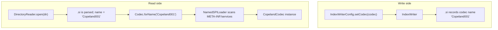
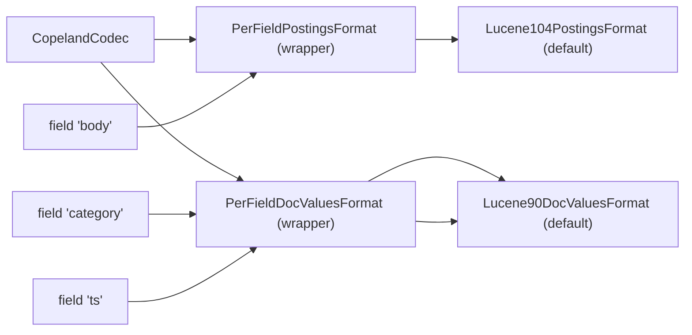

# Phase 1 — Learning Material

> `CopelandCodec` skeleton: a `FilterCodec` pass-through, registered as a
> named SPI, accepted by `IndexWriterConfig.setCodec(...)` and rediscovered
> automatically by `Codec.forName` when readers open segments tagged
> `Copeland001`.

This document covers everything Phase 1 of [the plan](../PLAN.md#phase-1--copelandcodec-skeleton-filtercodec-pass-through) asks you to learn:
the **Codec SPI**, **ServiceLoader registration**, **per-field codec selection** via
`PerFieldDocValuesFormat` / `PerFieldPostingsFormat`, and **`NamedSPILoader`**.

Companion files:
- [01-codec-skeleton.md](01-codec-skeleton.md) — running notes you fill in while doing the exercises.
- [../../src/main/java/dev/oddsystems/copeland/codec/CopelandCodec.java](../../src/main/java/dev/oddsystems/copeland/codec/CopelandCodec.java) — the codec class.
- [../../src/main/resources/META-INF/services/org.apache.lucene.codecs.Codec](../../src/main/resources/META-INF/services/org.apache.lucene.codecs.Codec) — SPI registration.
- [../../src/test/java/dev/oddsystems/copeland/codec/CopelandCodecRoundtripTest.java](../../src/test/java/dev/oddsystems/copeland/codec/CopelandCodecRoundtripTest.java) — the deliverable test.

---

## 1. The goal of Phase 1

Plug a *named, discoverable* codec into Lucene that behaves identically to
the default 10.4 codec. We change zero on-disk bytes, but we own the codec
identity. That gives us three things we will lean on later:

1. **A stable seam.** Every `*Format()` method passes through `CopelandCodec`,
   so when Phase 2 lands and we want a custom `DocValuesFormat`, only one
   accessor changes.
2. **An identity in segments.** `.si` files now record `Copeland001` as the
   codec name. Anything Copeland writes is unambiguously *ours* on disk,
   and any segment we ever wrote can still be opened by future versions
   that keep `Copeland001` on the classpath.
3. **A working SPI loop.** Lucene reads codecs purely by name from segment
   files. Until SPI registration works, there is no read-side codec at
   all — `Codec.forName("Copeland001")` would throw. Verifying the loop in
   Phase 1 means everything downstream can assume "the right codec is
   wired in" without re-debugging plumbing.

---

## 2. The Codec SPI in one picture



The asymmetry is the entire point. **Writers** hand you a codec object.
**Readers** receive only a *name* from the on-disk segment metadata, and
they must resolve that name into a class via SPI. If the name isn't in
the registry at read time, the index is unreadable.

This is exactly why `lucene-backward-codecs` exists: it keeps older codec
classes on the classpath so older segments can still be opened after a
Lucene upgrade.

---

## 3. SPI registration

Java's `ServiceLoader` looks at files named after a fully-qualified
interface inside `META-INF/services/` on the classpath. Each line in the
file is a fully-qualified implementation class. Lucene wraps this with
`NamedSPILoader`, which additionally keys each implementation by the
**string name** it reports via `getName()`.

For Copeland, the registration is a single line in
[`src/main/resources/META-INF/services/org.apache.lucene.codecs.Codec`](../../src/main/resources/META-INF/services/org.apache.lucene.codecs.Codec):

```
dev.oddsystems.copeland.codec.CopelandCodec
```

Three invariants you must preserve:

| Invariant | Why |
|-----------|-----|
| The SPI file name is the FQCN of the **abstract** Lucene class. | `ServiceLoader.load(Codec.class)` looks for `META-INF/services/org.apache.lucene.codecs.Codec`. |
| The class listed must have a **public no-arg constructor**. | `ServiceLoader` instantiates via reflection with no args. |
| The string returned by `getName()` must be **unique** across all codecs reachable from the classpath. | `NamedSPILoader` indexes by name and throws on duplicates. |

The `getName()` contract is enforced through the `Codec(String name)`
super constructor. In our case `super("Copeland001", new Lucene104Codec())`
in [CopelandCodec.java](../../src/main/java/dev/oddsystems/copeland/codec/CopelandCodec.java).

---

## 4. `NamedSPILoader` semantics

`NamedSPILoader` is a tiny wrapper over `ServiceLoader` with three behaviours
you need to know:

1. **Eager scan at first reference.** The first call to `Codec.forName(...)`,
   `Codec.availableCodecs()`, or any other named-SPI lookup triggers a scan
   of every `META-INF/services` file on the classpath. The result is cached.
2. **Duplicate names are a hard failure.** If two `Codec` SPI entries both
   return `"Copeland001"` from `getName()`, classpath load throws. This is
   not just developer-friendliness: it is necessary because segment files
   resolve codecs by name only.
3. **`reload(ClassLoader)` exists but is rarely used.** Application servers
   that hot-reload classes call it to refresh the registry. Plain Gradle /
   `java -cp` workflows never touch it.

There is one classic footgun, called out in
[`FilterCodec`'s javadoc](https://lucene.apache.org/core/10_4_0/core/org/apache/lucene/codecs/FilterCodec.html):

> Please note: Don't call `Codec.forName` from the no-arg constructor of
> your own codec. When the SPI framework loads your own Codec as SPI
> component, SPI has not yet fully initialized!

That's why [CopelandCodec.java](../../src/main/java/dev/oddsystems/copeland/codec/CopelandCodec.java)
constructs `new Lucene104Codec()` directly rather than going through
`Codec.forName("Lucene104")`. The Lucene contributors learned this the
hard way; we copy their pattern.

---

## 5. `FilterCodec` vs `Lucene104Codec` as a base

There are two natural starting points for a custom codec:

| Base class | Pros | Cons |
|------------|------|------|
| `FilterCodec` | Forwards every sub-format method explicitly. Very small, very obvious. No assumptions about Lucene 10.4 internals. | No `getPostingsFormatForField` / `getDocValuesFormatForField` hooks. To do per-field routing you re-implement the `PerField*Format` wrappers yourself. |
| `Lucene104Codec` | Inherits the per-field routing hooks already used by Lucene's default. Per-field swaps are 5-line overrides. | Bound to 10.4's specific composition. If 10.5 changes which sub-format is the default, your subclass might pick up that change implicitly. |

Phase 1 chooses `FilterCodec` deliberately. It's the cleanest "I am a
named pass-through" and it sets up Phase 2 to *replace* the doc-values
slot rather than *route* per-field at first. We can refactor to extend
`Lucene104Codec` (or compose with `PerFieldDocValuesFormat` ourselves)
when we need that flexibility.

---

## 6. Per-field codec selection

Lucene's default codec doesn't return a "single" `DocValuesFormat` or
`PostingsFormat`. It returns a *wrapper* that picks the actual format
per-field at write and read time. Look at `Lucene104Codec` source:

```java
private final DocValuesFormat docValuesFormat =
    new PerFieldDocValuesFormat() {
      @Override
      public DocValuesFormat getDocValuesFormatForField(String field) {
        return Lucene104Codec.this.getDocValuesFormatForField(field);
      }
    };
```

So `codec.docValuesFormat()` returns a `PerFieldDocValuesFormat` whose
hook delegates back to a method on the codec itself. The default
implementation of that hook just returns `defaultDVFormat` (a
`Lucene90DocValuesFormat` instance). Subclasses override the hook to
route specific fields elsewhere.

The on-disk signal that makes this work is the per-field filename. When
you look at `dump` output from a segment written with our Copeland codec:

```
_0_Lucene104_0.doc          (doc/freq postings)
_0_Lucene104_0.pos          (positions)
_0_Lucene104_0.tim          (term dictionary)
_0_Lucene90_0.dvd           (doc values data)
_0_Lucene90_0.dvm           (doc values metadata)
```

The middle token is the **format name** that wrote the file
(`Lucene104PostingsFormat`, `Lucene90DocValuesFormat`). The trailing `_0`
is a per-segment, per-format generation counter — `PerFieldPostingsFormat`
disambiguates when two fields in the same segment use *different* postings
formats. Conceptually:



When Phase 2 lands and we ship `CopelandNumericDocValuesFormat`, the
override looks like:

```java
@Override
public DocValuesFormat getDocValuesFormatForField(String field) {
    if (field.equals("ts") || field.equals("count")) {
        return new CopelandNumericDocValuesFormat();
    }
    return defaultDVFormat;
}
```

Lucene takes care of routing the right reader per-field on read, using the
format name recorded in `FieldInfo`.

---

## 7. Trade-offs

The plan explicitly asks us to think about two trade-offs in this phase:

1. **Per-field routing vs uniform codec.**
   - *Uniform* (one `DocValuesFormat` for the whole index): simpler, smaller
     metadata, slightly faster — one format handle is reused across fields.
   - *Per-field* (current default): pay one extra indirection plus a
     per-field format-name entry in `FieldInfo` (the `.fnm` file grows by
     a few bytes per field). You buy the ability to evolve formats
     incrementally and to specialise hot fields. For an analytics-first
     store, the bytes are well spent.

2. **Cost of `FilterCodec` indirection.**
   - At write time the delegate is hit once per `IndexWriter.flush` per
     sub-format. Cost is sub-microsecond per call; the writer is
     I/O-bound.
   - At read time the per-segment codec object is cached; per-field
     routing is a string-keyed lookup in `PerFieldPostingsFormat`, hot
     and fast.
   - **There is no measurable performance cost.** The whole purpose of
     the SPI design is to make custom codecs cheap.

We'll revisit this once we have JMH (Phase 9) — until then, "no
measurable cost" is the working assumption, not the proven one.

---

## 8. Cross-cutting concerns

- **Backwards compatibility.** Anything written under `Copeland001` must
  remain readable forever — that is, as long as the `CopelandCodec`
  class stays on the classpath. The moment we bump to `Copeland002`,
  we have two choices: keep `CopelandCodec` registered as a *reader-only*
  legacy class (like `lucene-backward-codecs`), or merge all
  `Copeland001` segments forward before deleting the class. Phase 8
  (merges) will give us a clean way to do the latter.
- **Thread safety.** A `Codec` is shared across `IndexWriter`s and
  `IndexReader`s. Lucene's contract is that codecs are immutable. Our
  `FilterCodec` instance is trivially safe — the delegate
  (`Lucene104Codec`) is itself immutable.
- **Module path vs classpath.** Lucene 10.x ships as automatic modules.
  Plain `ServiceLoader` works on both classpath and module path *as long
  as* we either declare `provides org.apache.lucene.codecs.Codec with
  dev.oddsystems.copeland.codec.CopelandCodec;` in a `module-info.java`
  (module path) or keep the `META-INF/services` file (classpath, which
  is what we use today via Gradle's `application` plugin).

---

## 9. Build & wire-up

[build.gradle.kts](../../build.gradle.kts) already brings in
`lucene-core` (which contains `Codec`, `FilterCodec`, `NamedSPILoader`,
`PerFieldDocValuesFormat`, `PerFieldPostingsFormat`) and
`lucene-codecs` (which contains the `Lucene104Codec` default). Nothing
else is needed for Phase 1.

[Main.java](../../src/main/java/dev/oddsystems/copeland/Main.java) grew a
`--codec=default|copeland` flag, passed through to
[SampleIndexer.run(...)](../../src/main/java/dev/oddsystems/copeland/tools/SampleIndexer.java).
`IndexWriterConfig.setCodec(...)` is the only place the codec is
explicitly injected at write time. Read time is implicit — `SegmentReader`
resolves the codec from `.si` via SPI, with no API call from us.

---

## 10. Exercises

These produce the data you'll record in [01-codec-skeleton.md](01-codec-skeleton.md).

1. **Default vs Copeland.** Write 10k docs with each codec into two dirs,
   then dump both:
   ```bash
   ./gradlew --quiet run --args="write-sample build/tmp/phase1/default 10000"
   ./gradlew --quiet run --args="write-sample build/tmp/phase1/copeland 10000 --codec=copeland"
   ./gradlew --quiet run --args="dump build/tmp/phase1/default"
   ./gradlew --quiet run --args="dump build/tmp/phase1/copeland"
   ```
   - Compare the two outputs. What is the *only* line that differs?
   - Confirm per-field filenames (`_0_Lucene104_0.doc`, `_0_Lucene90_0.dvd`)
     are identical. Why?

2. **Hex-peek at `.si`.** Look at the segment-info file:
   ```bash
   hexdump -C build/tmp/phase1/copeland/_0.si | head -20
   ```
   Find the ASCII string `Copeland001`. Now do the same for the default
   run and find `Lucene104`. This is the exact byte the codec name lives
   in.

3. **SPI sanity check.** Programmatic, no index needed:
   ```bash
   ./gradlew test --tests CopelandCodecRoundtripTest.copelandCodec_is_discoverable_via_spi
   ./gradlew test --tests CopelandCodecRoundtripTest.available_codecs_listing_contains_copeland
   ```

4. **Break SPI on purpose.** Temporarily rename the SPI file:
   ```bash
   mv src/main/resources/META-INF/services/org.apache.lucene.codecs.Codec{,.disabled}
   ./gradlew test --tests CopelandCodecRoundtripTest
   ```
   Observe the failure mode. What exception does Lucene throw? Move the
   file back:
   ```bash
   mv src/main/resources/META-INF/services/org.apache.lucene.codecs.Codec{.disabled,}
   ```

5. **Break the name on purpose.** Change `Copeland001` -> `copeland001`
   (lowercase) in [CopelandCodec.java](../../src/main/java/dev/oddsystems/copeland/codec/CopelandCodec.java),
   recompile, write a fresh index, then revert. What happens on read?

6. **Read the per-field filename anatomy.** Match each token in
   `_0_Lucene104_0.doc` against the explanation in
   [Phase 0 learning notes](../phase0/learning.md#4-the-codec-in-detail).
   - segment name: `_0`
   - format name: `Lucene104`
   - per-segment format generation: `_0`
   - extension: `.doc`

---

## 11. Glossary additions

These augment the Phase 0 glossary; the Phase 0 entries still apply.

- **SPI (Service Provider Interface)** — Java's pluggable contract
  mechanism. Lucene uses it (via `NamedSPILoader`) for every
  user-replaceable component: codecs, postings formats, doc-values
  formats, kNN vector formats, sort field providers, tokenizer
  factories.
- **`NamedSPILoader`** — Lucene's wrapper over `ServiceLoader` that adds
  name-keyed lookup and duplicate-name detection.
- **`FilterCodec`** — abstract `Codec` that forwards every sub-format
  accessor to a delegate. Comfortable base class for a "rename and
  identity-only" codec like Phase 1's `CopelandCodec`.
- **`PerFieldDocValuesFormat` / `PerFieldPostingsFormat` /
  `PerFieldKnnVectorsFormat`** — formats that dispatch to a different
  underlying format per field. They embed the chosen format name into
  segment filenames and into per-field metadata so readers can route
  correctly.
- **Codec name** — the string returned by `Codec.getName()`, recorded in
  `.si` for each segment, looked up via `Codec.forName(...)` on read.
  Globally unique across the classpath.

---

## 12. References

- Lucene 10.4.0 javadoc:
  - [`Codec`](https://lucene.apache.org/core/10_4_0/core/org/apache/lucene/codecs/Codec.html)
  - [`FilterCodec`](https://lucene.apache.org/core/10_4_0/core/org/apache/lucene/codecs/FilterCodec.html)
  - [`PerFieldPostingsFormat`](https://lucene.apache.org/core/10_4_0/core/org/apache/lucene/codecs/perfield/PerFieldPostingsFormat.html)
  - [`PerFieldDocValuesFormat`](https://lucene.apache.org/core/10_4_0/core/org/apache/lucene/codecs/perfield/PerFieldDocValuesFormat.html)
  - [`Lucene104Codec`](https://lucene.apache.org/core/10_4_0/core/org/apache/lucene/codecs/lucene104/Lucene104Codec.html)
- `org.apache.lucene.util.NamedSPILoader` (in `lucene-core-10.4.0-sources.jar`).
- Java `ServiceLoader` docs: <https://docs.oracle.com/en/java/javase/26/docs/api/java.base/java/util/ServiceLoader.html>.
- `lucene-backward-codecs` as a worked example of "legacy codecs kept on the classpath for read compatibility".
